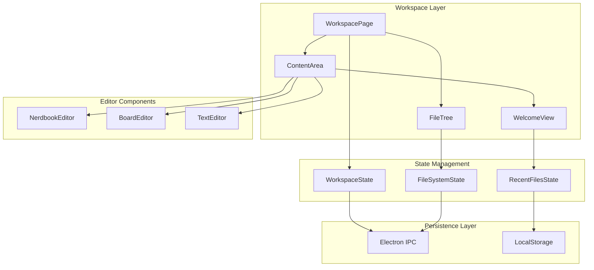

# Design Document: IDE Workspace

## Overview

This design transforms the Notebook page into an IDE-style workspace that unifies all note types (Nerdbooks, Boards, Quick Notes) under a file system metaphor. The workspace features a VS Code-inspired file tree sidebar, custom file extensions for type identification, folder-based organization, and smooth navigation transitions.

The implementation uses React with TypeScript, leveraging the existing component architecture and Electron IPC for persistence. The design prioritizes a seamless user experience with animated transitions, intuitive file management, and automatic data migration.

## Architecture



### Component Hierarchy

```
App
└── WorkspacePage
    ├── FileTreeSidebar
    │   ├── BackButton
    │   ├── ActionBar (New File, New Folder)
    │   ├── FileTreeNode (recursive)
    │   │   ├── FolderNode
    │   │   └── FileNode
    │   └── ContextMenu
    └── ContentArea
        ├── WelcomeView
        │   ├── RecentFilesList
        │   └── QuickActions
        ├── FileHeader
        └── EditorContainer
            ├── NerdbookEditor (existing)
            ├── BoardEditor (existing)
            └── TextNoteEditor (new)
```

## Components and Interfaces

### WorkspacePage Component

The main container that orchestrates the workspace UI, managing the file tree sidebar and content area.

```typescript
interface WorkspacePageProps {
  setPage: (page: Page) => void;
  onSidebarTransition: (visible: boolean) => void;
}

interface WorkspaceState {
  selectedFileId: string | null;
  expandedFolders: Set<string>;
  isTransitioning: boolean;
}
```

### FileTree Component

Renders the hierarchical file/folder structure with icons and interaction handlers.

```typescript
interface FileTreeProps {
  files: WorkspaceFile[];
  folders: WorkspaceFolder[];
  selectedFileId: string | null;
  expandedFolders: Set<string>;
  onFileSelect: (fileId: string) => void;
  onFolderToggle: (folderId: string) => void;
  onFileCreate: (parentId: string | null, type: FileType) => void;
  onFolderCreate: (parentId: string | null) => void;
  onRename: (id: string, newName: string) => void;
  onDelete: (id: string) => void;
  onMove: (id: string, newParentId: string | null) => void;
}

interface FileTreeNodeProps {
  item: WorkspaceFile | WorkspaceFolder;
  depth: number;
  isSelected: boolean;
  isExpanded?: boolean;
  onSelect: () => void;
  onToggle?: () => void;
  onContextMenu: (e: React.MouseEvent) => void;
}
```

### ContentArea Component

Displays the appropriate editor based on the selected file type, or the welcome view when no file is selected.

```typescript
interface ContentAreaProps {
  selectedFile: WorkspaceFile | null;
  recentFiles: RecentFile[];
  onFileSelect: (fileId: string) => void;
  onFileCreate: (type: FileType) => void;
  onContentChange: (fileId: string, content: any) => void;
}
```

### File Type Icons

Using Lucide icons already available in the project:

| File Type | Extension | Icon Component |
|-----------|-----------|----------------|
| Executable Notebook | `.exec` | `FileCode` |
| Board/Whiteboard | `.board` | `PenTool` |
| Quick Note | `.note` | `FileText` |
| Folder (closed) | - | `Folder` |
| Folder (open) | - | `FolderOpen` |

## Data Models

### Core Types

```typescript
// File extension types
type FileType = 'exec' | 'board' | 'note';

// File extension mapping
const FILE_EXTENSIONS: Record<FileType, string> = {
  exec: '.exec',
  board: '.board',
  note: '.note',
};

// Icon mapping for file types
const FILE_ICONS: Record<FileType, LucideIcon> = {
  exec: FileCode,
  board: PenTool,
  note: FileText,
};

// Workspace file representation
interface WorkspaceFile {
  id: string;
  name: string;           // Without extension (e.g., "project-notes")
  type: FileType;         // Determines extension and editor
  parentId: string | null; // null = root level
  createdAt: string;      // ISO date string
  updatedAt: string;      // ISO date string
  contentId: string;      // Reference to actual content (nerdbook id, board id, etc.)
}

// Workspace folder representation
interface WorkspaceFolder {
  id: string;
  name: string;
  parentId: string | null; // null = root level
  createdAt: string;
  updatedAt: string;
}

// Combined workspace structure for persistence
interface WorkspaceData {
  files: WorkspaceFile[];
  folders: WorkspaceFolder[];
  recentFiles: string[];  // Array of file IDs, most recent first
  expandedFolders: string[]; // Array of folder IDs that are expanded
  migrationComplete: boolean;
}

// Recent file display data
interface RecentFile {
  id: string;
  name: string;
  type: FileType;
  lastOpened: string;     // ISO date string
  path: string;           // Full path like "Projects/Web/notes.exec"
}
```

### File Naming Validation

```typescript
interface FileNameValidation {
  isValid: boolean;
  error?: string;
}

// Validation rules:
// 1. Name cannot be empty
// 2. Name cannot contain: / \ : * ? " < > |
// 3. Name + type combination must be unique within parent folder
```

### Migration Data Mapping

```typescript
// Mapping from existing data to workspace files
interface MigrationMapping {
  nerdbooks: Map<string, WorkspaceFile>;  // nerdbook.id -> workspace file
  boards: Map<string, WorkspaceFile>;      // board.id -> workspace file
  quickNotes: Map<string, WorkspaceFile>;  // quickNote.id -> workspace file
}
```

## Correctness Properties

*A property is a characteristic or behavior that should hold true across all valid executions of a system-essentially, a formal statement about what the system should do. Properties serve as the bridge between human-readable specifications and machine-verifiable correctness guarantees.*

### Property 1: File Name Uniqueness Validation

*For any* folder containing files, and any attempt to create or rename a file, the operation SHALL succeed if and only if no existing file in that folder has the same name AND same type.

**Validates: Requirements 1.4, 1.5, 6.2**

### Property 2: File Display Format

*For any* workspace file with a name and type, the display function SHALL produce a string in the format "{name}.{extension}" where extension matches the file type.

**Validates: Requirements 1.2**

### Property 3: File Creation with Extension

*For any* valid file name and file type, creating a new file SHALL produce a WorkspaceFile with the correct type property that maps to the appropriate extension.

**Validates: Requirements 1.3**

### Property 4: Tree Structure Rendering

*For any* workspace data containing files and folders with parent-child relationships, the tree rendering function SHALL produce a hierarchical structure where each item appears under its correct parent.

**Validates: Requirements 2.1**

### Property 5: Folder Toggle State

*For any* folder in the file tree, toggling its expanded state SHALL invert the current expanded value (true becomes false, false becomes true).

**Validates: Requirements 2.4**

### Property 6: File Selection Updates State

*For any* file in the workspace, selecting it SHALL update the selectedFileId state to that file's ID.

**Validates: Requirements 2.5, 5.4**

### Property 7: Folder Creation at Any Level

*For any* valid parent folder ID (including null for root), creating a folder SHALL succeed and the new folder's parentId SHALL equal the specified parent.

**Validates: Requirements 3.1**

### Property 8: Item Move Operation

*For any* file or folder and any valid target folder (that is not a descendant of the item being moved), moving the item SHALL update its parentId to the target folder's ID while preserving all other properties.

**Validates: Requirements 3.2, 3.3**

### Property 9: Cascading Folder Delete

*For any* folder containing files and/or subfolders, deleting the folder SHALL remove the folder AND all its descendants (files and nested folders) from the workspace.

**Validates: Requirements 3.4**

### Property 10: Folder Name Uniqueness

*For any* parent folder (including root), creating or renaming a folder SHALL fail if another folder with the same name already exists in that parent.

**Validates: Requirements 3.6**

### Property 11: Workspace State Persistence Round-Trip

*For any* valid workspace state (files, folders, recent files, expanded folders), serializing to storage and then deserializing SHALL produce an equivalent workspace state.

**Validates: Requirements 4.5, 9.1, 9.2, 9.4, 9.5**

### Property 12: Welcome View Display Condition

*For any* workspace state where selectedFileId is null, the content area SHALL render the welcome view component.

**Validates: Requirements 5.1**

### Property 13: Recent Files Cap

*For any* list of recently opened files, the displayed list SHALL contain at most 10 items, showing the most recent first.

**Validates: Requirements 5.2**

### Property 14: File Deletion Behavior

*For any* file that is deleted, the file SHALL be removed from the workspace files array, AND if that file was currently selected, the selectedFileId SHALL be set to null.

**Validates: Requirements 6.4**

### Property 15: Migration Creates Workspace Files

*For any* existing nerdbook, board, or quick note, migration SHALL create a corresponding WorkspaceFile with the correct type (.exec for nerdbooks, .board for boards, .note for quick notes) and a contentId referencing the original item.

**Validates: Requirements 7.1, 7.2, 7.3**

### Property 16: Migration Preserves Content Reference

*For any* migrated item, the created WorkspaceFile's contentId SHALL reference the original item's ID, ensuring content can be loaded from existing storage.

**Validates: Requirements 7.4**

### Property 17: Migration Idempotence

*For any* workspace where migration has been marked complete, running the migration function again SHALL NOT create duplicate workspace files.

**Validates: Requirements 7.5**

### Property 18: Editor Selection by File Type

*For any* selected file, the content area SHALL render the editor component corresponding to the file's type: NerdbookEditor for .exec, BoardEditor for .board, TextNoteEditor for .note.

**Validates: Requirements 8.1, 8.2, 8.3**

### Property 19: File Header Display

*For any* open file, the content area header SHALL display the file's name and type icon.

**Validates: Requirements 8.4**

## Error Handling

### File Operations

| Error Condition | Handling Strategy |
|-----------------|-------------------|
| Duplicate file name + type | Display validation error, prevent creation/rename |
| Duplicate folder name | Display validation error, prevent creation/rename |
| Invalid file name characters | Display validation error with list of invalid characters |
| Empty file/folder name | Display validation error, require non-empty name |
| Delete non-existent item | Log warning, no-op (idempotent) |
| Move to invalid target (descendant) | Display error, prevent move |
| Move to non-existent folder | Display error, prevent move |

### Persistence Errors

| Error Condition | Handling Strategy |
|-----------------|-------------------|
| Failed to save workspace | Display toast notification, retry with exponential backoff |
| Failed to load workspace | Initialize with empty workspace, log error |
| Corrupted workspace data | Attempt recovery, fall back to empty workspace |
| Migration failure | Log error, allow manual retry, preserve original data |

### Content Loading Errors

| Error Condition | Handling Strategy |
|-----------------|-------------------|
| Content not found for file | Display error in content area, offer to delete orphaned file |
| Failed to load nerdbook | Display error message in editor area |
| Failed to load board | Display error message in editor area |
| Failed to load quick note | Display error message in editor area |

## Testing Strategy

### Property-Based Testing

Property-based tests will use `fast-check` library for TypeScript to generate random inputs and verify properties hold across all cases.

**Configuration:**
- Minimum 100 iterations per property test
- Each test tagged with: `Feature: ide-workspace, Property {number}: {property_text}`

**Test Files:**
- `src/utils/workspace.test.ts` - Core workspace logic tests
- `src/utils/workspaceValidation.test.ts` - Validation function tests
- `src/utils/workspaceMigration.test.ts` - Migration logic tests

### Unit Tests

Unit tests complement property tests by covering:
- Specific edge cases (empty names, special characters)
- Error conditions and error messages
- Integration points between components
- UI state transitions

**Test Files:**
- `src/components/FileTree.test.tsx` - File tree component tests
- `src/components/ContentArea.test.tsx` - Content area component tests
- `src/pages/Workspace.test.tsx` - Workspace page integration tests

### Test Data Generators

```typescript
// Generator for valid file names
const validFileNameArb = fc.string({ minLength: 1, maxLength: 50 })
  .filter(s => !/[\/\\:*?"<>|]/.test(s) && s.trim().length > 0);

// Generator for file types
const fileTypeArb = fc.constantFrom('exec', 'board', 'note');

// Generator for workspace files
const workspaceFileArb = fc.record({
  id: fc.uuid(),
  name: validFileNameArb,
  type: fileTypeArb,
  parentId: fc.option(fc.uuid(), { nil: null }),
  createdAt: fc.date().map(d => d.toISOString()),
  updatedAt: fc.date().map(d => d.toISOString()),
  contentId: fc.uuid(),
});

// Generator for workspace folders
const workspaceFolderArb = fc.record({
  id: fc.uuid(),
  name: validFileNameArb,
  parentId: fc.option(fc.uuid(), { nil: null }),
  createdAt: fc.date().map(d => d.toISOString()),
  updatedAt: fc.date().map(d => d.toISOString()),
});
```

### Coverage Goals

- Property tests: All 19 correctness properties
- Unit tests: Error handling paths, edge cases
- Integration tests: File tree + content area interaction

